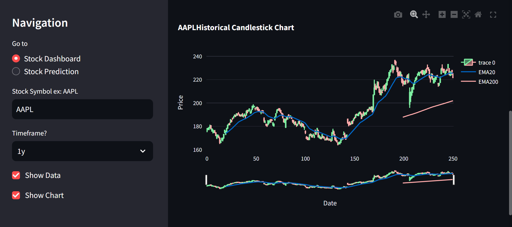

# Stock Analysis and Prediction Dashboard

## 📊 Comprehensive Stock Market Insights at Your Fingertips

This powerful Python application combines real-time stock analysis with machine learning-based predictions, providing traders and investors with a robust toolkit for making informed decisions.

### 🖼️ Screenshots


*Stock Analysis Dashboard showing real-time data and technical indicators*


### 🌟 Key Features

1. **Dynamic Stock Dashboard**
   - Real-time stock data visualization
   - Technical indicators (EMA, RSI, ADX)
   - Performance metrics and trend analysis

2. **AI-Powered Stock Prediction**
   - Machine learning forecasting using Prophet
   - Customizable prediction timeframes
   - Interactive forecast visualizations

3. **User-Friendly Interface**
   - Built with Streamlit for a smooth, interactive experience
   - Easy navigation between analysis and prediction tools
   - Responsive design for desktop and mobile use

### 🛠 Technologies Used

- Python
- Streamlit
- yfinance
- pandas
- pandas_ta
- Plotly
- Prophet

### 🚀 Getting Started

1. Clone the repository:
   ```
   git clone https://github.com/yourusername/stock-analysis-prediction.git
   ```
2. Navigate to the project directory:
   ```
   cd stock-analysis-prediction
   ```
3. Install dependencies:
   ```
   pip install -r requirements.txt
   ```
4. Run the app:
   ```
   streamlit run app.py
   ```

### 💡 How It Works

The app consists of two main components:

1. **Stock Dashboard**: Fetches real-time stock data, calculates technical indicators, and presents a comprehensive analysis of the selected stock's performance and trends.

2. **Stock Prediction**: Utilizes Facebook's Prophet library to forecast future stock prices based on historical data, allowing users to visualize potential future trends.

### 🎯 Who Is This For?

- Day traders seeking real-time market insights
- Long-term investors analyzing historical trends
- Finance enthusiasts exploring stock market dynamics
- Data scientists interested in financial modeling and prediction

### 🤝 Contributing

We welcome contributions! Please follow these steps:

1. Fork the project
2. Create your feature branch (`git checkout -b feature/AmazingFeature`)
3. Commit your changes (`git commit -m 'Add some AmazingFe
